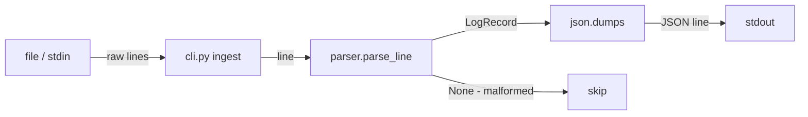

# logpipe Skeleton — High-Level Plan

## Starting Prompt

lets build out a minimum skelton of the log ingest app. The scope for this plan should be just enough to ingest log lines, parse them into an internal record, and then echo them back out.

---

## § High-Level Plan

### Scope

Parse log lines → structured `LogRecord` → echo as JSON Lines to stdout.
No storage. No query. Just the ingestion + parse + echo loop, with a black-box test proving it works.

---

### Project structure

```
project/
├── pyproject.toml          # deps + CLI entrypoint
├── logpipe/
│   ├── __init__.py
│   ├── cli.py              # `logpipe ingest <file|->`
│   └── parser.py           # regex → LogRecord dataclass
└── tests/
    ├── conftest.py         # shared fixtures / CLI runner helper
    └── test_ingest.py      # black-box: feed lines, assert JSON output
```

---

### Log format

Extended Combined Log Format — standard Apache/nginx + `response_time` appended:

```
127.0.0.1 - frank [10/Oct/2000:13:55:36 -0700] "GET /apache_pb.gif HTTP/1.1" 200 2326 0.042
```

Regex:

```python
LOG_PATTERN = re.compile(
    r'(?P<host>\S+) \S+ (?P<user>\S+) \[(?P<timestamp>[^\]]+)\] '
    r'"(?P<method>\S+) (?P<path>\S+) \S+" (?P<status>\d{3}) (?P<bytes>\d+|-) '
    r'(?P<response_time>\d+(?:\.\d+)?)'
)
```

---

### Core domain object

```python
# logpipe/parser.py
from dataclasses import dataclass

@dataclass
class LogRecord:
    host: str
    user: str
    ts: int           # Unix epoch seconds (UTC)
    method: str
    path: str
    status: int
    bytes: int | None
    response_time: float

def parse_line(line: str) -> LogRecord | None:
    """Return a LogRecord or None if the line is malformed."""
    ...
```

---

### CLI interface (this plan only)

```
logpipe ingest <file>    # parse file, echo JSON Lines to stdout
logpipe ingest -         # read from stdin
```

Output: one JSON object per valid line, written to stdout. Malformed lines are silently skipped (printed to stderr in a future iteration).

Example:

```
$ echo '127.0.0.1 - - [10/Oct/2000:13:55:36 -0700] "GET /index.html HTTP/1.1" 200 1234 0.021' | logpipe ingest -
{"host": "127.0.0.1", "user": "-", "ts": 971186136, "method": "GET", "path": "/index.html", "status": 200, "bytes": 1234, "response_time": 0.021}
```

---

### Data flow



---

### Black-box test cases

Tests invoke the CLI via subprocess against a real file or stdin. No mocking.

```
test_ingest.py
  ✓ test_single_valid_line      — one valid line → one JSON object on stdout, exit 0
  ✓ test_all_fields_present     — JSON output contains all expected keys
  ✓ test_timestamp_is_epoch     — ts field is an integer (Unix epoch)
  ✓ test_stdin_input            — `logpipe ingest -` reads from stdin
  ✓ test_malformed_line_skipped — bad line → no output, exit 0 (not a crash)
  ✓ test_mixed_valid_invalid    — 2 valid + 1 bad → 2 JSON lines output
```

---

### `pyproject.toml` shape

```toml
[project]
name = "logpipe"
version = "0.1.0"
requires-python = ">=3.11"
dependencies = ["typer"]

[project.scripts]
logpipe = "logpipe.cli:app"

[build-system]
requires = ["hatchling"]
build-backend = "hatchling.build"

[tool.pytest.ini_options]
testpaths = ["tests"]
```

---

### Documentation impact

| File | Change |
|---|---|
| `project/README.md` | New — student setup + usage for this skeleton |
| Root `README.md` | No change needed yet |
