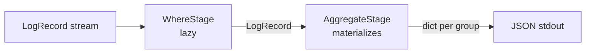
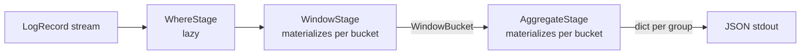

# High-Level Plan: AGGREGATE Stage

## Starting Prompt

lets implement the AGGREGATE stage

---

## § High-level plan

### Modules that change

| File | Change |
|---|---|
| `logpipe/stages/aggregate.py` | **New file** — `AggregateStage` and helpers |
| `logpipe/cli.py` | Add `--group-by` option; wire `AggregateStage` into pipeline |
| `project/ARCHITECTURE.md` | Update Module Layout; mark AGGREGATE as Implemented |
| `tests/test_aggregate.py` | **New file** — integration tests |

---

### Data flow

Without WINDOW:



With WINDOW:



`AggregateStage.process()` detects whether it receives `LogRecord` or `WindowBucket`
objects and handles each accordingly — no pipeline plumbing changes needed.

---

### Key types — `stages/aggregate.py`

```python
# Numeric LogRecord fields eligible for SUM/AVG/MIN/MAX
NUMERIC_FIELDS = ("bytes", "response_time")

class AggregateStage:
    def __init__(self, group_by: list[str]) -> None:
        self.group_by = group_by

    def process(
        self, records: Iterable[LogRecord | WindowBucket]
    ) -> Iterable[dict]:
        ...
```

`process()` implementation:

1. If it receives `WindowBucket` objects → aggregate each bucket independently,
   include `window_start`/`window_end` in every output dict.
2. If it receives `LogRecord` objects → aggregate all records as one group.

Aggregation per collection of records: group by `self.group_by` fields,
compute for each group:
- `count` — COUNT(*)
- `{field}_sum`, `{field}_avg`, `{field}_min`, `{field}_max` for each of
  `bytes`, `response_time` (skip `None` values for `bytes`)

---

### Output shape (one JSON line per group)

Without window:
```json
{"host": "192.168.1.1", "count": 3, "response_time_avg": 0.031, "bytes_avg": 1540.0}
```

With window:
```json
{"window_start": 971211300, "window_end": 971211600, "host": "192.168.1.1", "count": 2, "response_time_avg": 0.025, "bytes_avg": 980.0}
```

---

### CLI change — `cli.py`

```python
def query(
    expr: str,
    source: str,
    window: str | None = None,
    group_by: Annotated[str | None, typer.Option(
        "--group-by",
        help="Comma-separated field(s) to group by, e.g. 'host' or 'host,method'"
    )] = None,
):
```

Pipeline construction:
```python
stages: list[Stage] = [WhereStage(parse_predicate(expr))]
if window is not None:
    stages.append(WindowStage(WindowSpec(size_secs=parse_duration(window))))
if group_by is not None:
    fields = [f.strip() for f in group_by.split(",")]
    stages.append(AggregateStage(fields))
```

Output loop: when `AggregateStage` is active every item is already a `dict`
(not `LogRecord` or `WindowBucket`), so the existing `isinstance(item, WindowBucket)`
branch is replaced by a simpler check:

```python
for item in pipeline.run(valid_records):
    if isinstance(item, dict):
        print(json.dumps(item))
    elif isinstance(item, WindowBucket):
        print(json.dumps({...}))  # existing behaviour when no --group-by
    else:
        print(json.dumps(asdict(item)))
```

---

### Documentation updates

`ARCHITECTURE.md`:
- `## SQL-Style Execution Order` table: change AGGREGATE Status from `Future` → `Implemented`
- `## Module Layout (target state)`: add `stages/aggregate.py` entry

---

### Feedback Log

> On `NUMERIC_FIELDS = ("status", "bytes", "response_time")`:
> `^^ doesn't make sense to include HTTP status here ^^`
> — `status` removed; `NUMERIC_FIELDS` is now `("bytes", "response_time")` only.
