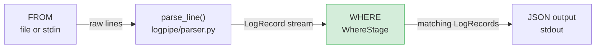
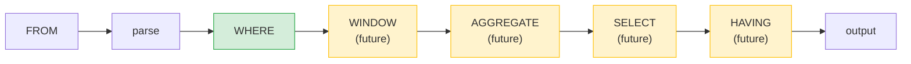

# Querying — Filtering (High-Level Plan)

## Starting Prompt

> lets start working on querying. while I only want this plan to focus on filtering, I am planning for more advanced features like aggregate operations, windowing, grouping, etc.

---

## § High-Level Plan

### Scope

Add a `query` subcommand to `logpipe` that reads a log source, parses it into `LogRecord` objects, applies a filter expression, and streams the matching records as JSON. The internal architecture follows a **SQL-style execution pipeline** — see [ARCHITECTURE.md](../project/ARCHITECTURE.md) for the full forward-looking design.

This plan covers **WHERE (filtering) only**.

---

### SQL-Style Pipeline

The full query pipeline follows SQL's logical processing order:

```
FROM      → implicit: the source argument (file or stdin)
WHERE     → filter raw LogRecords               ← THIS PLAN
WINDOW    → partition stream into time buckets   (future)
AGGREGATE → group-by + aggregate functions       (future)
SELECT    → project fields / computed values     (future)
HAVING    → filter on projected/aggregated cols  (future)
```

**Where windowing fits:** WINDOW sits between WHERE and AGGREGATE. It partitions the filtered record stream into time-based buckets (e.g. 5-minute tumbling windows), and AGGREGATE then runs independently within each bucket. This is distinct from SQL window functions — it's closer to stream-processing semantics (think Flink/Spark Structured Streaming).

Each stage is implemented as a `Stage` object in a `Pipeline`. Future plans add stages; this plan adds `WhereStage`.

---

### CLI Interface

The `query` command takes the WHERE expression as a positional string argument, followed by the source. This keeps the interface simple as expressions grow more complex — no flag juggling.

```bash
# Filter from a log file
logpipe query "status >= 400" access.log

# AND / OR inside the expression
logpipe query "status >= 400 AND method = POST" access.log
logpipe query "status = 200 OR status = 201" access.log

# Stdin
logpipe query "response_time > 1.0" -
```

**Supported operators:**

| Op | Meaning |
|----|---------|
| `=` | equality |
| `!=` | inequality |
| `<` `>` `<=` `>=` | numeric / lexicographic comparison |
| `~` | substring match (string fields) |

**Filterable fields** (all fields of `LogRecord`):
`host`, `user`, `ts`, `method`, `path`, `status`, `bytes`, `response_time`

---

### Module Changes

| File | Change |
|------|--------|
| `logpipe/query.py` | **New.** Filter expression parser, `Op` type, `FilterExpr`, `Predicate`, `WhereStage`, `Pipeline`. |
| `logpipe/cli.py` | Add `query` command; wire positional `expr` arg through pipeline. |
| `tests/test_query.py` | **New.** Black-box tests for `logpipe query`. |
| `project/README.md` | Add `query` command usage section. |
| `project/ARCHITECTURE.md` | **New.** Forward-looking query pipeline design doc. |

No changes to `parser.py` (LogRecord stays as-is).

---

### Data / UX Flow



**Full future pipeline (for context — not in this plan):**



---

### Core Domain Objects (`logpipe/query.py`)

```python
from typing import Callable, Iterable, Any, Literal, Protocol
from dataclasses import dataclass
from logpipe.parser import LogRecord

# ------------------------------------------------------------------
# Strong type for comparison operators
# ------------------------------------------------------------------
Op = Literal["=", "!=", "<", ">", "<=", ">=", "~"]

# ------------------------------------------------------------------
# Predicate: a function from LogRecord → bool
# ------------------------------------------------------------------
Predicate = Callable[[LogRecord], bool]


@dataclass
class FilterExpr:
    """A single comparison: field op value."""
    field: str   # e.g. "status"
    op: Op       # one of the 7 operators — not an arbitrary string
    value: Any   # coerced to field's native type


def parse_predicate(expr: str) -> Predicate:
    """
    Parse a WHERE expression string into a callable predicate.
    Supports AND / OR combinators (no parentheses in v1).

    Examples:
        "status >= 400"
        "method = GET OR method = POST"
        "response_time > 1.0"
    """
    ...


# ------------------------------------------------------------------
# Pipeline stage abstraction (extensibility hook)
# ------------------------------------------------------------------
class Stage(Protocol):
    def process(self, records: Iterable[Any]) -> Iterable[Any]: ...


@dataclass
class WhereStage:
    predicate: Predicate

    def process(self, records: Iterable[LogRecord]) -> Iterable[LogRecord]:
        return (r for r in records if self.predicate(r))


class Pipeline:
    def __init__(self, stages: list[Stage]) -> None:
        self.stages = stages

    def run(self, source: Iterable[Any]) -> Iterable[Any]:
        stream = source
        for stage in self.stages:
            stream = stage.process(stream)
        return stream
```

---

### CLI addition (`logpipe/cli.py`)

```python
@app.command()
def query(
    expr: Annotated[str, typer.Argument(help="Filter expression, e.g. 'status >= 400 AND method = POST'")],
    source: Annotated[str, typer.Argument(help="Log file path, or - for stdin")],
):
    """Query log records with a filter expression."""
    pipeline = Pipeline([WhereStage(parse_predicate(expr))])

    fh = sys.stdin if source == "-" else open(source)
    try:
        raw_records = (parse_line(line) for line in fh)
        valid_records = (r for r in raw_records if r is not None)
        for record in pipeline.run(valid_records):
            print(json.dumps(asdict(record)))
    finally:
        if fh is not sys.stdin:
            fh.close()
```

---

### Filter Expression Parser Design

A hand-rolled tokenizer + parser (no third-party deps). Grammar:

```
expr   := clause (("AND" | "OR") clause)*
clause := FIELD OP VALUE
FIELD  := host | user | ts | method | path | status | bytes | response_time
OP     := "=" | "!=" | "<" | ">" | "<=" | ">=" | "~"
VALUE  := bare word, quoted string, or number
```

Notes:
- `AND` binds tighter than `OR` (standard boolean precedence).
- Values are coerced to the field's native Python type (`int` for `status`, `float` for `response_time`, `str` for `host`/`method`/etc.).
- `~` does case-insensitive substring match on string fields.

---

### Tests (`tests/test_query.py`)

Black-box subprocess tests (same style as `test_ingest.py`):

| Test | Assertion |
|------|-----------|
| `test_filter_status_eq` | `"status = 200"` returns only 200 lines |
| `test_filter_status_gte` | `"status >= 400"` returns 4xx/5xx only |
| `test_filter_method` | `"method = GET"` returns only GETs |
| `test_filter_combined_and` | `"status >= 400 AND method = POST"` ANDs correctly |
| `test_filter_or` | `"status = 200 OR status = 404"` returns both |
| `test_filter_response_time` | Float comparison works on `response_time` |
| `test_filter_path_contains` | `"path ~ /api"` substring match |
| `test_no_match` | Non-matching filter → empty output, exit 0 |
| `test_stdin_query` | `source = -` works with filter |

---

### Documentation Updates

- **`project/README.md`**: Add `query` command section with examples after the existing `ingest` section.
- **`project/ARCHITECTURE.md`**: New file — forward-looking query pipeline design (created alongside this plan).

---

### What is NOT in this plan

- WINDOW stage: time-based stream partitioning
- AGGREGATE stage: `GROUP BY`, `COUNT`, `AVG`, `SUM`, `P95`, etc.
- SELECT stage: field projection, computed columns
- HAVING stage: post-aggregate filtering
- Output formats (CSV, table)
- Sorting / `LIMIT`

See [ARCHITECTURE.md](../project/ARCHITECTURE.md) for how these fit into the full design.

---

### Feedback Log

> this is a good plan. reading it closely I think I want to make a fundamental change: lets do something like SQL where our pipeline is processed in this order: FROM (implicit from the argument) -> WHERE (filtering) -> AGGREGATE (aggregate functions / grouping) -> SELECT (project the particular fields and agg results we care about) -> HAVING (filtering on the projected fields, mainly useful for filtering on the aggregates). The plan should still just cover the WHERE pipeline. It may also be helpful for this plan to generate a more general "architecture" doc with the forward looking pieces that future planning sessions can consult
>
> — Inline comment at top of plan, 2026-03-21

---

> something I left out of my feedback, but I shoul make explicit: how will windowing fit into this?
>
> Context: appeared after the SQL pipeline table (`FROM → WHERE → AGGREGATE → SELECT → HAVING`). Resolved by adding WINDOW as an explicit stage between WHERE and AGGREGATE, and documenting its stream-partitioning semantics in both the plan and ARCHITECTURE.md.

---

> lets just have query take a string of the query, since we're going to make these more complex and combining multiple flags would be confusing
>
> Context: appeared after `logpipe query --where "status >= 400" access.log`. Resolved by switching `--where` flag to a positional `expr` argument. CLI is now `logpipe query "status >= 400" access.log`.

---

> if you take my feedback from above than we don't need this variant at all
>
> Context: appeared after the multiple `--where` flag example. Resolved: removed that variant; the single positional expression handles AND/OR natively.

---

> can we make this strong with a type instead of just str?
>
> Context: appeared on the `op: str` field of `FilterExpr`. Resolved by introducing `Op = Literal["=", "!=", "<", ">", "<=", ">=", "~"]` and typing the field as `op: Op`.
