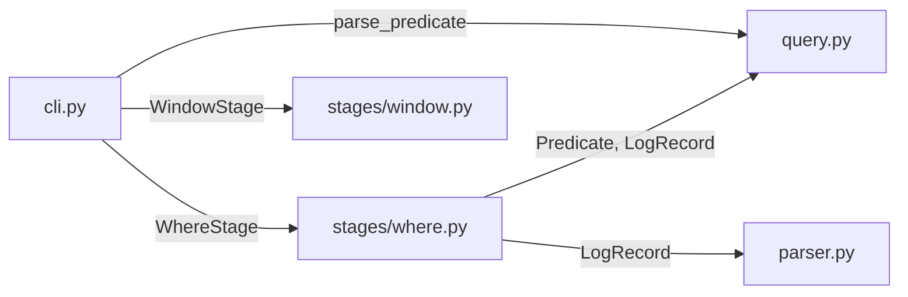

# High-Level Plan: Extract WhereStage to stages/where.py

## Starting Prompt

lets move the "where" stage out of query.py to stages/where.py

---

## § High-level plan

### Modules that change

| File | Change |
|---|---|
| `logpipe/query.py` | Remove `WhereStage` dataclass |
| `logpipe/stages/where.py` | **New file** — contains `WhereStage` |
| `logpipe/cli.py` | Update import: `WhereStage` from `stages.where` |

The predicate-parsing machinery (`FilterExpr`, `parse_predicate`, `_ExprParser`, etc.) stays in `query.py` — only the stage class moves.

### Data flow (unchanged at runtime)



### New file: `stages/where.py`

```python
from __future__ import annotations

from dataclasses import dataclass
from typing import Iterable

from logpipe.parser import LogRecord
from logpipe.query import Predicate


@dataclass
class WhereStage:
    predicate: Predicate

    def process(self, records: Iterable[LogRecord]) -> Iterable[LogRecord]:
        return (r for r in records if self.predicate(r))
```

### Updated import in `cli.py`

```python
# before
from logpipe.query import Pipeline, Stage, WhereStage, parse_predicate

# after
from logpipe.query import Pipeline, Stage, parse_predicate
from logpipe.stages.where import WhereStage
```

### `query.py` — remove these lines (221–226)

```python
@dataclass
class WhereStage:
    predicate: Predicate

    def process(self, records: Iterable[LogRecord]) -> Iterable[LogRecord]:
        return (r for r in records if self.predicate(r))
```

### Documentation updates

`ARCHITECTURE.md` has a `## Module Layout (target state)` section that needs updating to reflect `stages/where.py` as a new module.

---

### Feedback Log

> Line 76–77: `^^ sort of true; ARCHITECTURE does have a ## Module Layout (target state) section that would need updating ^^`
> — on "No documentation updates needed" / "No README or ARCHITECTURE files reference WhereStage directly."
