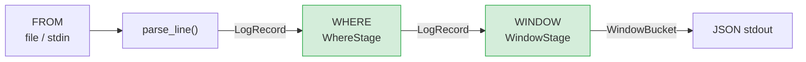

# Window Stage — High-Level Plan

## Starting Prompt

lets tackle the "window" stage

---

## § High-level plan

### Context

logpipe's query pipeline follows SQL's logical execution order:

```
FROM  →  WHERE  →  WINDOW  →  AGGREGATE  →  SELECT  →  HAVING
  ✅         ✅          ⬅ here       ⏳           ⏳        ⏳
```

WHERE is done. WINDOW is next. AGGREGATE is not in scope this session.

---

### What changes

| File | Change |
|---|---|
| `logpipe/query.py` | Add `parse_duration()`, `WindowSpec`, `WindowStage` |
| `logpipe/cli.py` | Add `--window` option to `query` command; change output format when windowing |
| `tests/test_window.py` | New integration test file (subprocess-based, same pattern as existing tests) |
| `project/ARCHITECTURE.md` | Update WINDOW status from _Future_ → _Implemented_ |

`logpipe/parser.py` — no changes needed.

---

### Duration parsing

`--window` accepts a human-readable string like `5m`, `1h`, `30s`.

```python
_DURATION_RE = re.compile(r"^(\d+)(s|m|h)$")

def parse_duration(s: str) -> int:
    """Parse a duration string into seconds. E.g. '5m' → 300, '1h' → 3600."""
    m = _DURATION_RE.match(s.strip())
    if not m:
        raise ValueError(f"Invalid duration {s!r} — expected e.g. '5m', '1h', '30s'")
    n, unit = int(m.group(1)), m.group(2)
    return n * {"s": 1, "m": 60, "h": 3600}[unit]
```

---

### WindowSpec and WindowStage

Tumbling windows only (non-overlapping fixed-size buckets). Sliding/session are out of scope.

```python
@dataclass
class WindowSpec:
    size_secs: int          # bucket duration in seconds

@dataclass
class WindowBucket:
    window_start: int       # epoch seconds
    window_end: int         # epoch seconds (exclusive)
    records: list[LogRecord]

class WindowStage:
    def __init__(self, spec: WindowSpec) -> None:
        self.spec = spec

    def process(self, records: Iterable[LogRecord]) -> Iterable[WindowBucket]:
        # Groups records into fixed-size time buckets using record.ts
        # Assumes logs are roughly time-ordered (single-pass, dict accumulator)
        ...
```

The stage accumulates records keyed by `bucket_start = (ts // size_secs) * size_secs`, then yields one `WindowBucket` per key in sorted order. This is a single-pass O(N) scan — no sorting required.

---

### Data flow



Without `--window`, the pipeline is unchanged (WHERE → JSON output, same as today).

---

### CLI output format

Without `--window` (current behaviour, unchanged):
```json
{"host": "10.0.0.1", "status": 404, ...}
```

With `--window 5m` (new):
```json
{"window_start": 971211000, "window_end": 971211300, "count": 3, "records": [...]}
```

One JSON object per bucket. `records` is the list of matching `LogRecord` dicts within that bucket.

CLI invocation:
```bash
logpipe query "status >= 400" --window 5m access.log
logpipe query "status >= 400" --window 1h -            # stdin
```

---

### cli.py changes (sketch)

```python
@app.command()
def query(
    expr: str,
    source: str = typer.Argument(...),
    window: str | None = typer.Option(None, "--window", help="Tumbling window size, e.g. 5m, 1h, 30s"),
) -> None:
    records = (parse_log_record(line) for line in _open(source))
    records = (r for r in records if r is not None)

    stages: list[Stage] = [WhereStage(parse_predicate(expr))]
    if window:
        stages.append(WindowStage(WindowSpec(size_secs=parse_duration(window))))

    pipeline = Pipeline(stages)
    for item in pipeline.run(records):
        if isinstance(item, WindowBucket):
            print(json.dumps({
                "window_start": item.window_start,
                "window_end": item.window_end,
                "count": len(item.records),
                "records": [dataclasses.asdict(r) for r in item.records],
            }))
        else:
            print(json.dumps(dataclasses.asdict(item)))
```

---

### Test plan

`tests/test_window.py` — black-box CLI subprocess tests, same pattern as `test_query.py`:

- `make_log_line(ts=...)` fixture to construct log lines with known timestamps
- Window with no matches → no output
- 3 records spanning two 5-minute buckets → 2 JSON lines, correct `window_start`/`window_end`
- All records in one bucket → 1 JSON line with correct `count`
- Combined WHERE + WINDOW: only matching records appear in buckets
- `--window` with stdin `-`
- Invalid duration string → non-zero exit

---

### What's NOT in scope

- Sliding or session windows
- AGGREGATE, SELECT, HAVING (future sessions)
- Watermarks / late-data handling (logs assumed roughly time-ordered)
- `--window` without an expression (may relax this later when WHERE becomes optional)
