# logpipe — Query Pipeline Architecture

This document describes the full intended query pipeline architecture. Individual planning sessions implement one stage at a time; consult this doc for context on how each piece fits.

---

## SQL-Style Execution Order

logpipe's `query` command follows SQL's logical processing order:

```
FROM  →  WHERE  →  WINDOW  →  AGGREGATE  →  SELECT  →  HAVING
```

| Stage | CLI | Status | Description |
|-------|-----|--------|-------------|
| FROM | positional `source` arg | Implemented (via `ingest`) | Log file path or `-` for stdin |
| WHERE | positional `expr` arg | Planned (current work) | Filter expression string, e.g. `"status >= 400 AND method = POST"` |
| WINDOW | `--window` | Implemented (tumbling only) | Partition stream into fixed-size time buckets before aggregation |
| AGGREGATE | `--group-by`, aggregate functions in SELECT | Future | Group records and compute aggregates (within each window if WINDOW is active) |
| SELECT | `--select` | Future | Project fields; define computed / aggregated columns |
| HAVING | `--having` | Future | Filter on projected / aggregated values |

---

## Pipeline Abstraction

Each stage implements the `Stage` protocol and is composed into a `Pipeline`:

```python
class Stage(Protocol):
    def process(self, records: Iterable[Any]) -> Iterable[Any]: ...

class Pipeline:
    def run(self, source: Iterable[Any]) -> Iterable[Any]: ...
```

Stages are streamed — records flow through lazily where possible. Stages that require full materialization (e.g. AGGREGATE) consume the stream and emit a new one.

```
Source (lazy) → WHERE (lazy) → WINDOW (materializes per bucket) → AGGREGATE (materializes per group) → SELECT (lazy) → HAVING (lazy) → output
```

---

## Stage Designs

### FROM (implicit)

Already implemented by `ingest`. The `query` command re-uses `parse_line()` from `logpipe/parser.py` to produce a stream of `LogRecord` objects from a file or stdin.

---

### WHERE

Filters the `LogRecord` stream with boolean predicates.

**Expression grammar:**
```
expr   := clause (("AND" | "OR") clause)*
clause := FIELD OP VALUE
FIELD  := host | user | ts | method | path | status | bytes | response_time
OP     := "=" | "!=" | "<" | ">" | "<=" | ">=" | "~"
VALUE  := bare word | quoted string | number
```

Multiple `--where` flags are AND-ed at the top level.

**Key types:**
```python
Predicate = Callable[[LogRecord], bool]

class WhereStage:
    predicate: Predicate
    def process(self, records: Iterable[LogRecord]) -> Iterable[LogRecord]: ...
```

---

### WINDOW

Partitions the filtered `LogRecord` stream into time-based buckets. AGGREGATE then runs independently within each bucket, enabling time-series analysis.

This is stream-processing semantics (closer to Flink/Spark Structured Streaming than SQL window functions).

**Intended CLI shape:**
```bash
logpipe query "status >= 400" \
        --window 5m \
        --group-by host \
        --select "host, COUNT(*) as errors" \
        access.log
```

**Window types (planned):** tumbling (non-overlapping fixed-size buckets), sliding (overlapping), session (gap-based)

**Key types (sketch):**
```python
from datetime import timedelta
from enum import Enum

class WindowType(Enum):
    TUMBLING = "tumbling"
    SLIDING  = "sliding"
    SESSION  = "session"

@dataclass
class WindowSpec:
    type: WindowType
    size: timedelta           # bucket duration
    slide: timedelta | None   # for sliding windows; None → same as size

class WindowStage:
    spec: WindowSpec
    def process(self, records: Iterable[LogRecord]) -> Iterable[tuple[int, Iterable[LogRecord]]]:
        # yields (bucket_start_ts, records_in_bucket)
        ...
```

WINDOW materializes records per bucket (must see all records in a window before emitting). For tumbling windows on ordered logs this is bounded; for unordered logs a watermark/grace period is needed (future concern).

---

### AGGREGATE

Groups records by one or more fields and computes aggregate functions over each group.

**Intended CLI shape:**
```bash
logpipe query --where "status >= 400" \
              --group-by host \
              --select "host, COUNT(*) as errors, AVG(response_time) as avg_rt" \
              access.log
```

**Aggregate functions (planned):** `COUNT`, `SUM`, `AVG`, `MIN`, `MAX`, `P50`, `P95`, `P99`

**Key types (sketch):**
```python
@dataclass
class GroupKey:
    fields: list[str]

@dataclass
class AggregateExpr:
    fn: str          # "COUNT", "AVG", etc.
    field: str | None  # None for COUNT(*)
    alias: str

class AggregateStage:
    group_key: GroupKey
    aggregates: list[AggregateExpr]
    def process(self, records: Iterable[LogRecord]) -> Iterable[dict]: ...
```

Note: AggregateStage materializes the full stream into memory (one dict per group), then emits the group rows. Output is `dict` not `LogRecord` from this point forward.

---

### SELECT

Projects specific fields and computed values from each row. After AGGREGATE, rows are dicts; SELECT shapes what appears in the final output.

**Intended CLI shape:**
```bash
--select "host, status, response_time"
--select "host, COUNT(*) as count"   # (with --group-by)
```

Without AGGREGATE, SELECT simply picks fields from `LogRecord`. With AGGREGATE, it names which computed columns to emit.

**Key types (sketch):**
```python
@dataclass
class SelectExpr:
    field: str
    alias: str | None

class SelectStage:
    exprs: list[SelectExpr]
    def process(self, records: Iterable[dict]) -> Iterable[dict]: ...
```

---

### HAVING

Filters rows after AGGREGATE + SELECT, using the same expression syntax as WHERE but operating on the projected dict keys (including aggregate aliases).

```bash
logpipe query --group-by host \
              --select "host, COUNT(*) as errors" \
              --having "errors > 10" \
              access.log
```

**Key types (sketch):**
```python
class HavingStage:
    predicate: Callable[[dict], bool]
    def process(self, records: Iterable[dict]) -> Iterable[dict]: ...
```

The predicate parser for HAVING is similar to WHERE's, but operates on `dict` keys rather than `LogRecord` attributes.

---

## Full Data Flow

```mermaid
flowchart LR
    SRC["FROM\nfile / stdin"] -->|raw lines| P["parse_line()"]
    P -->|LogRecord| W["WHERE\nWhereStage"]
    W -->|LogRecord| WI["WINDOW\nWindowStage"]
    WI -->|bucketed LogRecords| AG["AGGREGATE\nAggregateStage"]
    AG -->|dict per group| SEL["SELECT\nSelectStage"]
    SEL -->|projected dict| HAV["HAVING\nHavingStage"]
    HAV -->|dict| OUT["JSON stdout"]

    style W fill:#d4edda,stroke:#28a745
    style WI fill:#fff3cd,stroke:#ffc107
    style AG fill:#fff3cd,stroke:#ffc107
    style SEL fill:#fff3cd,stroke:#ffc107
    style HAV fill:#fff3cd,stroke:#ffc107
```



When a stage is omitted from the CLI invocation, it is a no-op passthrough (or skipped entirely in the pipeline construction).

---

## Module Layout (target state)

```
logpipe/
  parser.py        LogRecord, parse_line()              (done)
  query.py         Stage, Pipeline, Predicate,          (done)
                   expression parsers
  stages/
    where.py       WhereStage                           (done)
    window.py      WindowSpec, WindowBucket,            (done)
                   WindowStage, parse_duration()
  cli.py           ingest + query commands               (extending)
```

---

## Non-Goals

- SQL string parsing (no `SELECT ... FROM ... WHERE` syntax — each clause is a separate CLI flag)
- Joins across multiple sources
- Persistent storage or indexing
